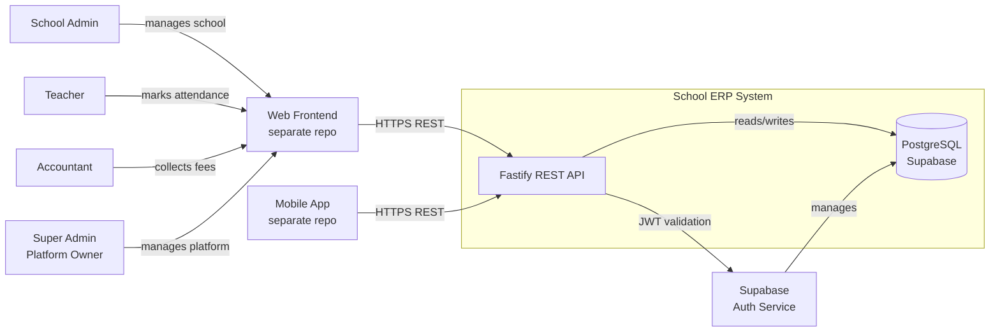
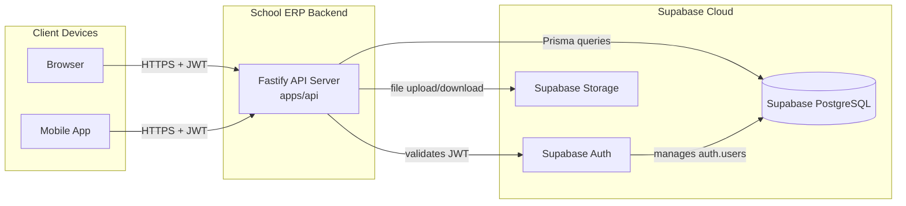
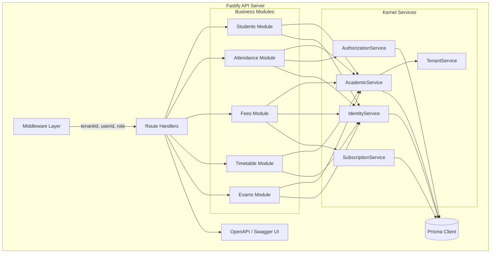

## Context

Greenfield build of a multi-tenant School ERP backend. The system serves Indian schools (CBSE, State Board, ICSE) via subdomain-routed SaaS, with an optional dedicated-deployment path for enterprise customers. Supabase provides authentication, PostgreSQL persistence, and Row Level Security. Fastify exposes REST APIs consumed by separate frontend and mobile applications (not in this change scope). The codebase follows Domain-Driven Design with a monorepo structure where kernel services own data access and business modules consume them via dependency injection.

### System Context



## Goals / Non-Goals

**Goals:**
- Establish monorepo scaffold with pnpm workspaces, Prisma, Fastify, and TypeScript
- Implement tenant isolation via subdomain routing and Row Level Security
- Integrate Supabase Auth for magic-link login with per-tenant user scoping
- Build configurable academic structure (Class/Section/Stream hierarchy per school)
- Deliver five business modules: Students, Attendance, Fees (free), Timetable, Exams (paid)
- Implement role-based access control with attribute-based data scoping (teacher sees only assigned classes/subjects)
- Provide module gating with free tier (3 modules, 100-student cap) and paid add-ons
- Support self-service signup with guided setup wizard and bulk student import
- Auto-generate OpenAPI 3.0 documentation from Fastify route schemas
- Enforce architectural boundary: modules never import database directly; kernel owns all data access

**Non-Goals:**
- Parent/Student portal or parent role
- Communication system (notices, SMS, email)
- Audit and notification kernel services
- Payment/billing integration
- Mobile or web frontend (separate repos)
- CI/CD pipeline or Docker deployment
- SMS gateway integration

## Decisions

### 1. Monorepo with pnpm workspaces

```
school-erp/
  packages/
    database/       @school-erp/database    Prisma schema + client
    shared/         @school-erp/shared      Types, validators, pagination, ID generation
    kernel/         @school-erp/kernel      Tenant, identity, authz, academic, subscription, config
    students/       @school-erp/students     Student enrollment, profiles, promotion
    attendance/     @school-erp/attendance   Daily attendance, reports
    fees/           @school-erp/fees         Fee structures, collections, receipts
    timetable/      @school-erp/timetable    Weekly schedule grid
    exams/          @school-erp/exams        Exam schedules, marks, report cards
  apps/
    api/            @school-erp/api          Fastify server, routes, middleware
```

**Rationale:** Single developer operating alone. Monorepo avoids versioning/publishing overhead while keeping bounded contexts cleanly separated as packages. pnpm workspaces provide workspace-local linking so `@school-erp/attendance` can import `@school-erp/kernel` as if it were a published package, but resolves to source on disk.

**Alternatives considered:**
- Separate repos per package → premature for solo dev; adds versioning and publishing ceremony
- Single flat project without packages → bounded contexts blur; hard to enforce module→kernel→database rule

### 2. Three-layer architecture (Module → Kernel → Database)

```
┌──────────────────────────────────────────────────┐
│  apps/api (Fastify routes, middleware)            │
│  Imports: shared, kernel, modules                 │
├──────────────────────────────────────────────────┤
│  packages/modules/*                               │
│  Business logic only. Imports: shared, kernel     │
│  NEVER imports database directly                  │
├──────────────────────────────────────────────────┤
│  packages/kernel                                  │
│  Data access layer. Imports: shared, database     │
│  Enforces: tenantId, deletedAt, validation        │
│  NEVER imports modules                            │
├──────────────────────────────────────────────────┤
│  packages/database    packages/shared             │
│  Prisma schema         Pure utilities             │
└──────────────────────────────────────────────────┘
```

**Rationale:** Modules should not write SQL or know table schemas. Kernel owns the contract with the database — it enforces tenant isolation, soft-delete filtering, and business invariants. Modules express domain intent ("record attendance for section 5A") and kernel translates to queries. This makes modules testable by mocking kernel, and schema changes only affect one package.

**Alternatives considered:**
- Modules call Prisma directly → data access scattered across codebase; tenant isolation easy to forget
- Repository per module → duplicates filtering logic; harder to change schema

### 3. Supabase Auth with subdomain routing

```
User visits stmarys.schoolerp.com
  → Frontend extracts subdomain → sends to API as X-Tenant header
  → API middleware resolves tenantId from subdomain
  → Supabase auth validates JWT session
  → Request context = { tenantId, userId, role }
```

**Rationale:** Supabase Auth handles user creation, magic-link emails, session tokens, and JWT verification. We never store passwords, never write auth code. Tenant membership lives in our `user_tenants` table linking `auth.users.id` to `tenants.id`. Subdomain determines which tenant context a login belongs to.

### 4. Configurable academic structure

Each school defines its hierarchy via a `level_definitions` table:

```
school_id | level_name | display_order | is_required
1         | Class      | 1             | true
1         | Section    | 2             | false
1         | Stream     | 3             | false
```

Actual instances form a tree via `level_instances` with a self-referencing `parent_id`:

```
Class 5 (parent: null)
  ├── Section A (parent: Class 5)
  └── Section B (parent: Class 5)
Class 11 (parent: null)
  ├── Science (parent: Class 11)
  │     ├── Section A (parent: Science)
  │     └── Section B (parent: Science)
  └── Commerce (parent: Class 11)
```

Students are assigned to the deepest level instance (leaf node). Teachers are linked via a junction table for class-teacher and subject-teacher assignments (many-to-many).

**Rationale:** Hardcoding "Class + Section" or "Class + Stream + Section" locks the product to one school type. Configurable levels let each school model their real structure — CBSE schools add "Stream" at senior secondary, small rural schools skip "Section" entirely.

### 5. Attribute-based data scoping

Two junction tables link teachers to classes:

```
class_teachers:    teacher_id | level_instance_id    (attendance duty)
subject_teachers:  teacher_id | subject_id | level_instance_id  (teaching duty)
```

When `AttendanceService.getStudentsForAttendance(teacherId)` is called, kernel queries `class_teachers` to find which section(s) the teacher owns, then returns only those students.

When `ExamService.getStudentsForMarkEntry(teacherId, subjectId)` is called, kernel queries `subject_teachers` for the teacher+subject+class combination.

**Rationale:** Business modules express intent ("give me my attendance roster"), kernel applies attribute filters. The module never decides scope — it cannot accidentally expose another teacher's class.

### 6. Free tier student cap enforcement

```
Student count per tenant: SELECT COUNT(*) FROM students WHERE tenant_id = X AND status = 'ACTIVE'
Cap check before INSERT: if count >= tenant.student_limit → throw StudentLimitExceededError
```

Hard limit blocks only `POST /students` — existing modules (attendance, fees) continue functioning for current students. Paid modules (timetable, exams) are independently gated via `tenant_modules.enabled` flag.

### Container Diagram



### Component Diagram (apps/api internals)



## Risks / Trade-offs

| Risk | Mitigation |
|------|-----------|
| Prisma loses Supabase-specific features (RLS, realtime, PostgREST) | Accept trade-off: Prisma gives type-safe queries and migration tooling critical for DDD architecture. RLS policies can be added as raw SQL migrations alongside Prisma. |
| Configurable academic structure adds query complexity | Index `level_instances.parent_id` and `level_instances.school_id`. Leaf-level assignment pattern means most queries join only 2-3 tables. |
| Monorepo grows large with all modules | pnpm workspace protocol keeps installs fast. CI can run tests per affected package. Split to separate repos only when team grows beyond 3 developers. |
| Hard student limit may frustrate schools mid-year | Admin sees a countdown ("95/100 students") and an upgrade prompt before hitting the limit. Emergency override available via super admin. |
| Supabase vendor lock-in | Auth uses standard JWT — migratable. Postgres is standard. RLS policies are plain SQL. Storage uses S3-compatible API. Migration cost is moderate, not catastrophic. |
| No audit trail in v1 | Accept risk for v1. V2 will add trigger-based PostgreSQL audit logging that backfills for all tables from v1. V1 tables designed with `created_at`, `updated_at`, `created_by` columns ready for audit. |

## Migration Plan

Greenfield deployment — no migration from existing system.

1. **Scaffold monorepo**: `pnpm init`, configure `pnpm-workspace.yaml`, create package directories with `package.json` files.
2. **Database first**: Define Prisma schema, run initial migration, generate client.
3. **Kernel then modules**: Build kernel services first (tenant, identity, academic, authz, subscription), then build business modules consuming kernel.
4. **API server last**: Wire routes to module services, add middleware (tenant resolution, auth, error handling), configure Swagger.
5. **Deploy**: Push to Supabase project, deploy Fastify server to hosting (Railway/Render/VPS).

Rollback: Not applicable for initial deployment. Schema changes are additive via Prisma migrations.

## Open Questions

- **Payment integration**: How will schools pay for paid modules? Manual invoicing for v1, but the `subscription-management` capability should leave a hook (`tenant_modules.payment_status`) for future Stripe/Razorpay integration.
- **Database-per-tenant for dedicated deployments**: The optional dedicated-deployment path requires a separate Supabase project per enterprise school. How does schema migration apply across multiple projects? Needs a migration strategy (likely: run Prisma migrate against each project's connection string).
- **Teacher-student relationship granularity**: Can a subject teacher be assigned to only a subset of students within a section (e.g., "Maths for 5A Science stream only")? Current design assigns subject teachers to entire level instances only. Flag for v2 if needed.
- **Frontend API contract stability**: OpenAPI specs are auto-generated, but frontend teams need a stable contract. Should we version the API (`/api/v1/...`) from day one? Leaning: yes, to allow backend evolution without breaking frontend.
- **No existing ADRs to supersede**: This is a greenfield project with no prior architectural decisions.
